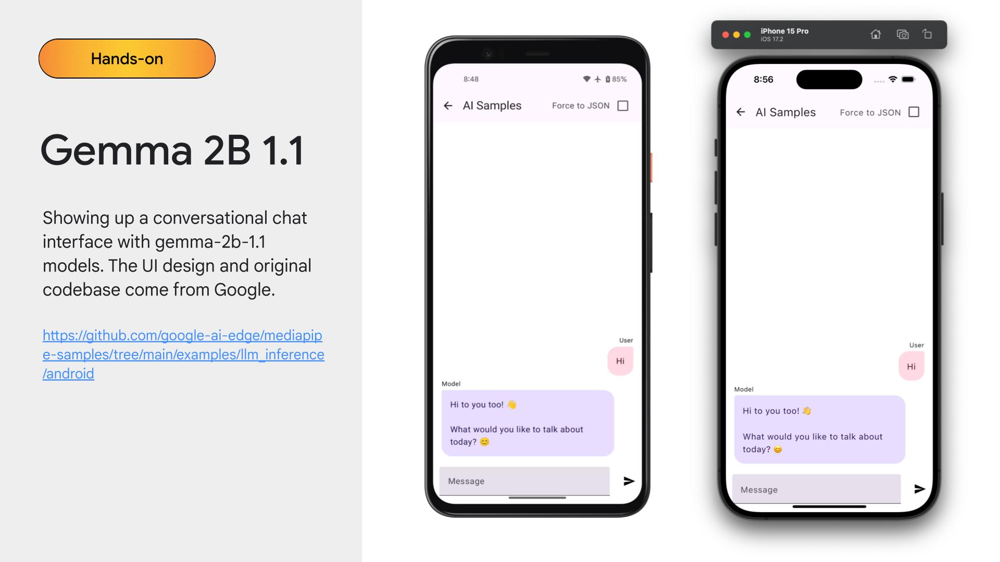

# MediaPiper

MediaPipe samples on Kotlin Multiplatform (Android and iOS).



Migration and Feature List:

| Feature | Package | Original Android Sample URL| Additional Setup|
|::|:---:|:---:|:---:|
|llm inference| me.xx2bab.mediapiper.llm |https://github.com/google-ai-edge/mediapipe-samples/tree/main/examples/llm_inference|For Android:|


## On-device Model Setup

1. Install JDK 17, Android Studio (with Android SDK), XCode (with iOS SDK) and Cocoapods.
2. Download 2 models, [gemma-1.1-2b-it-gpu-int4](https://www.kaggle.com/models/google/gemma/tfLite/gemma-1.1-2b-it-gpu-int4) and [gemma-1.1-2b-it-cpu-int8](https://www.kaggle.com/models/google/gemma/tfLite/gemma-1.1-2b-it-cpu-int8), from Kaggle respectively.
3. Execute below command to push models to Android device respectively (must be physical device) ```adb push /the/path/to/gemma-2b-it-gpu-int4.bin data/local/tmp/llm/```
4. Move models to iOS project respectively by dragging the model to the "iosApp" target and select "create folder reference".

## Running on Android

1. Open the project via Android Studio, create a ```local.properties```, put the android sdk path and cocoapods executable path.

```
sdk.dir=/Users/xxxx/Library/Android/sdk
kotlin.apple.cocoapods.bin=/opt/homebrew/lib/ruby/gems/3.3.0/bin/pod
```

2. Get it run via the Android Studio Run button.

## Running on iOS

1. Generate a dummy Framework

```shell
# cd to the root dir of this project and run below command
./gradlew :app:generateDummyFramework
```

2. Install the pod
```shell
# cd to /iosApp and run below command
pod install
```

3. Open the `/iosApp` project (`iosApp.xcworkspace`) via XCode, run it via the XCode Run button or Android Studio Run button with the KMP Plugin support. 

Once you modified the code, just reproduce step 3 and that's it!
